# 第1章 安装 VirtualBox  

## 1-1 软件下载地址

```shel
https://www.virtualbox.org/wiki/Downloads
```

[下载地址](https://www.virtualbox.org/wiki/Downloads)


下载完后，双击运行安装即可。如图所示：


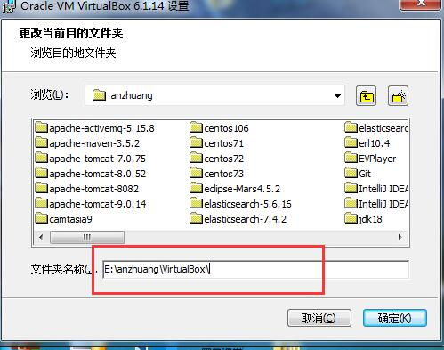


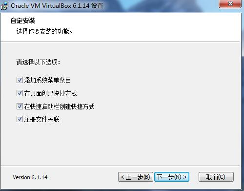


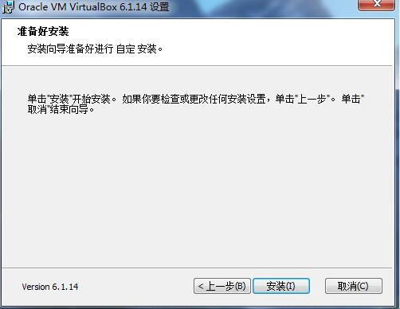


# 第2章 安装Vagrant


## 2-1 软件下载地址

```shell
 https://www.vagrantup.com/downloads 
```

[下载地址][ https://www.vagrantup.com/downloads ]


下载完成后，双击运行即可，如图所示：


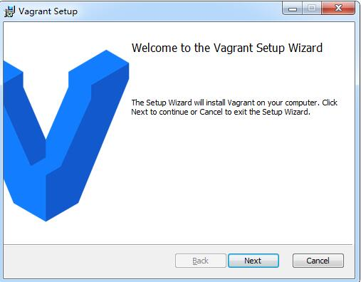


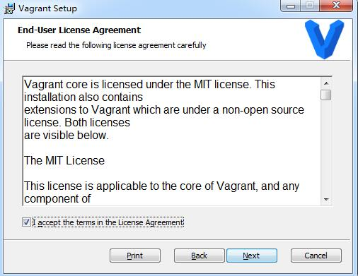

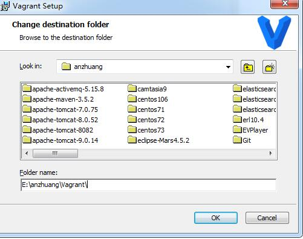


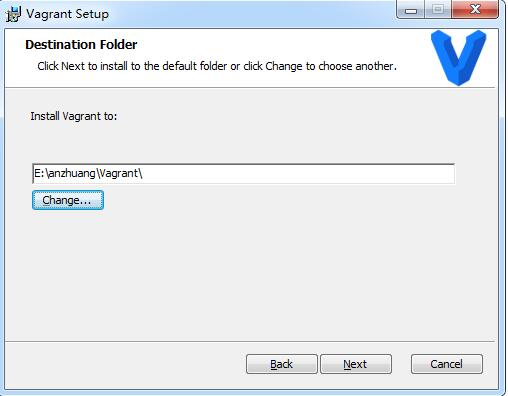


安装完后输入如下命令，是否安装成功：


```shell
vagrant
```

如图所示：


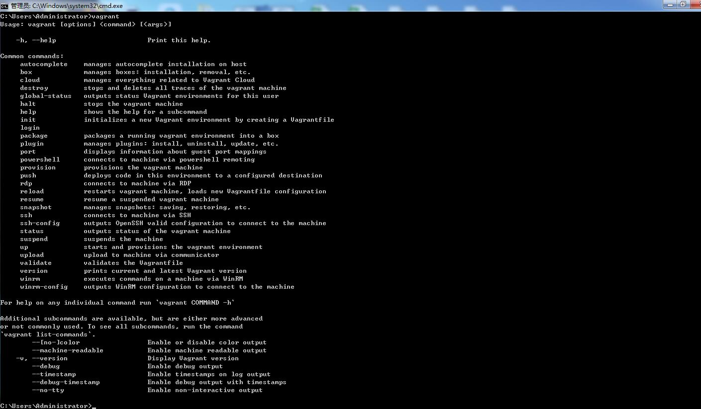


# 第3章 安装centos7


## 3-1 使用vagrant安装centos7


输入以下命令进行安装；

```shell
$ vagrant init centos/7
```

 执行完上面的命令后，会在用户指定目录下生成Vagrantfile文件。 

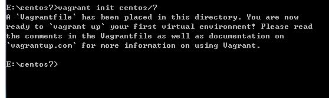


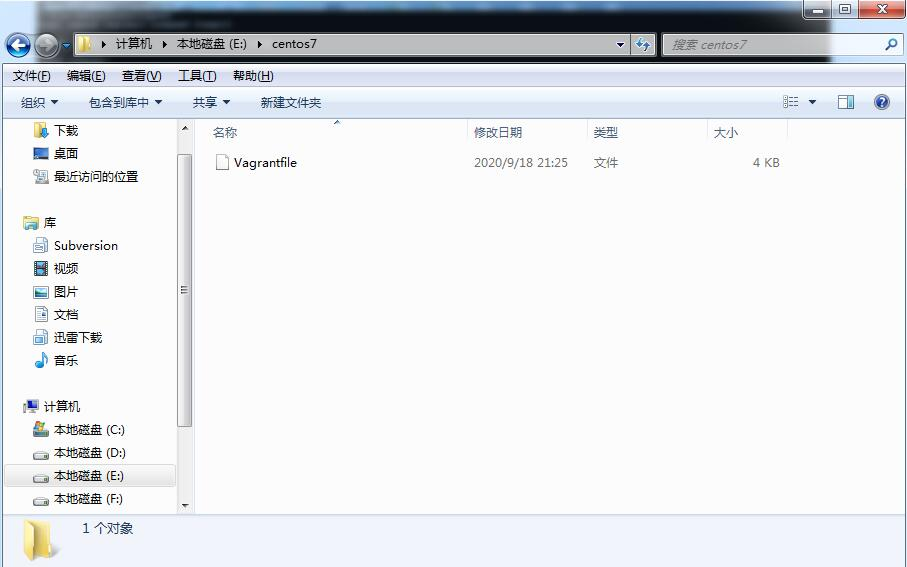


接着输入以下命令进行安装：

```shell
vagrant up
```

 下载镜像过程比较漫长 ，请耐心等待

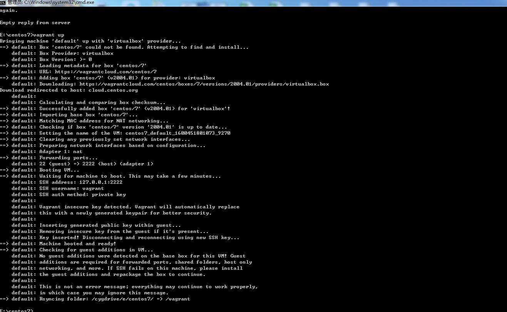


接着输入以下命令链接centos7：

```shell
vagrant ssh
```


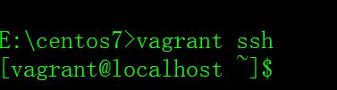


## 3-2 虚拟机网络设置

修改文件Vagrantfile，如下所示：

```shell
 config.vm.network "private_network", ip: "192.168.56.10"
```

修改完后，重启虚拟机即可


输入ip addr命令查看，是否配置成功，如下所示：

```shell
ip addr
```

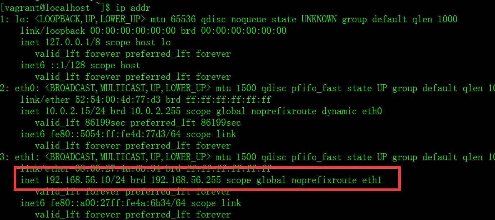


接着测试本地电脑和虚拟机是否互相ping得通，如下所示：


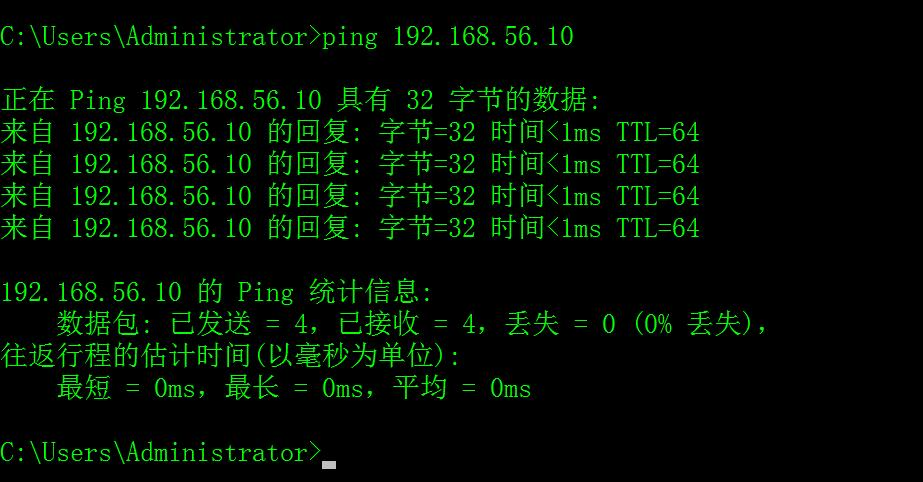


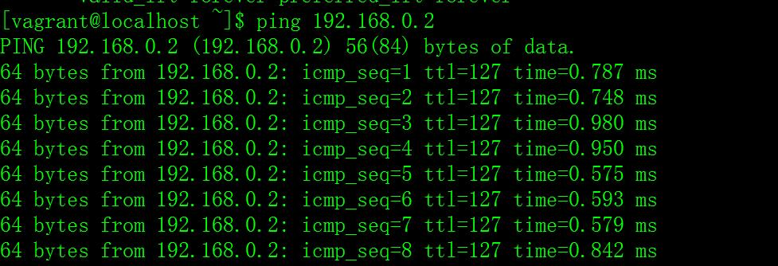


## 3-3  开启远程登陆

修改“/etc/ssh/sshd_config” 

```shell
PasswordAuthentication yes
```


 然后重启SSHD 

```shell
systemctl restart sshd
```


# 第4章 安装docker

**_注意 使用root账户登录系统_**

 docker安装官方文档： https://docs.docker.com/engine/install/centos/ 

## 4-1 卸载系统之前的docker


```shell
yum remove docker \
                  docker-client \
                  docker-client-latest \
                  docker-common \
                  docker-latest \
                  docker-latest-logrotate \
                  docker-logrotate \
                  docker-engine
```

如图所示：


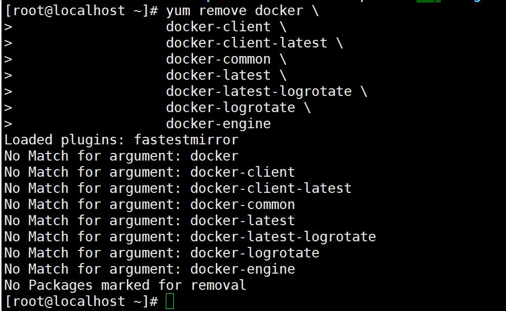


## 4-2 安装依赖包

输入如下命令安装：

```shell
yum install -y yum-utils
```


## 4-3 配置docker仓库

输入如下命令：

```shell
yum-config-manager \
    --add-repo \
    https://download.docker.com/linux/centos/docker-ce.repo
```


## 4-4 安装docker引擎

输入如下命令：

```shell
yum install docker-ce docker-ce-cli containerd.io
```

y

## 4-5 启动docker

输入一下命令：

```shell
systemctl start docker
```

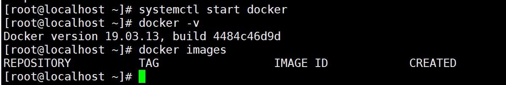


## 4-6 设置docker开机自启

输入一下命令：

```shell
systemctl enable docker
```

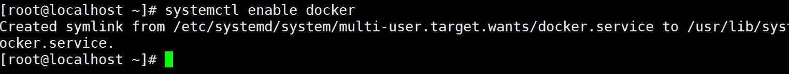


## 4-7 配置docker阿里云镜像加速

登录阿里云控制台，找到镜像加速

输入命令：

```shell
mkdir -p /etc/docker
```


输入命令：

```shell
tee /etc/docker/daemon.json <<-'EOF'
{
  "registry-mirrors": ["https://m0xbxmz4.mirror.aliyuncs.com"]
}
EOF
```


输入命令：

```shell
systemctl daemon-reload
```

```shell
systemctl restart docker
```


## 4-8 Docker开启远程访问

```shell
vi /lib/systemd/system/docker.service

```


 修改的地方如下图所示： 

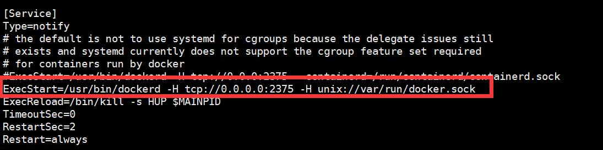


 重启Docker服务： 

```shel
systemctl daemon-reload 
systemctl restart docker.service
```


检查是否正确

```shell
curl http://localhost:2375/version
```


## 4-9 IDEA使用Docker插件

 IDEA Ultimate版本已经默认安装了Docker插件（没有的话去插件市场下载安装下就可以了）。点击IDEA -> File -> Settings… -> Build,Execution,Deployment -> Docker： 

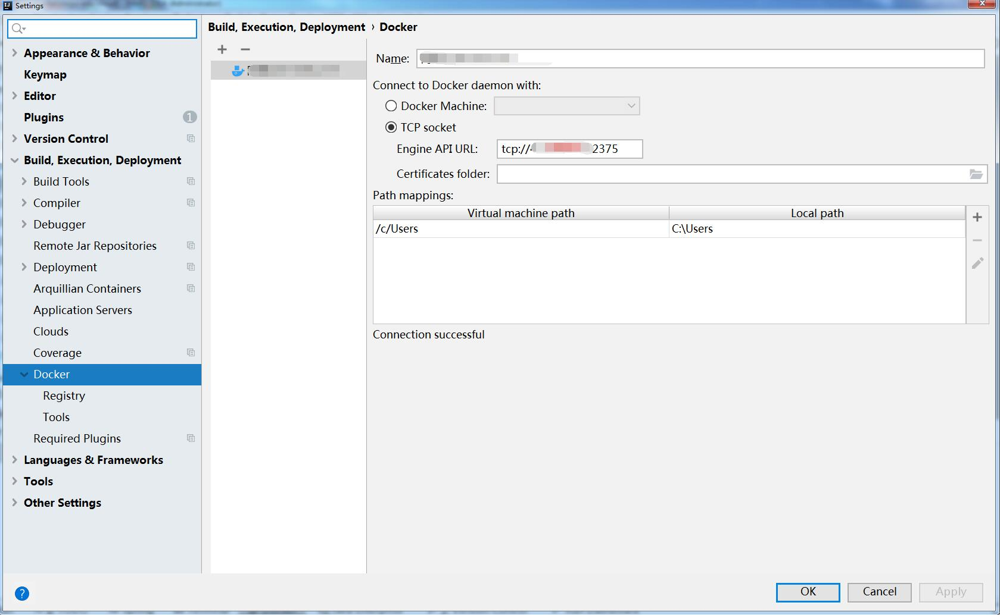


 填写远程Docker地址，如果显示Connection Successfully说明连接远程Docker服务成功。 


## 4-10 安装Docker Compose

官网地址： https://docs.docker.com/compose/install/ 

1. 获取Docker Compose的最新稳定版本 ：

```shell
curl -L "https://github.com/docker/compose/releases/download/1.27.3/docker-compose-$(uname -s)-$(uname -m)" -o /usr/local/bin/docker-compose
```

2.  对二进制文件授予可执行权限： 

   ~~~shell
   chmod +x /usr/local/bin/docker-compose
   ~~~

   

3. 创建link： 

   ```shell
   ln -s /usr/local/bin/docker-compose /usr/bin/docker-compose
   
   ```

   

4.  查看是否安装成功： 

   ```shell
   docker-compose --version
   ```

   

## 4-11 查看容器

```shell
docker ps  #正在运行

docker ps -a # 已退出

```


## 4-12 删除容器

```shell
docker rm 容器id
```


## 4-13 删除镜像

```shell
docker rmi 镜像id
```


## 4.14  安装**Portainer** 可视化工具

 **下载Portainer镜像** 

```shell
docker pull portainer/portainer
```

 **运行Portainer** 

```shell
docker run -d -p 9000:9000 \
    --restart=always \
    -v /var/run/docker.sock:/var/run/docker.sock \
    --name prtainer-test \
    portainer/portainer
```


