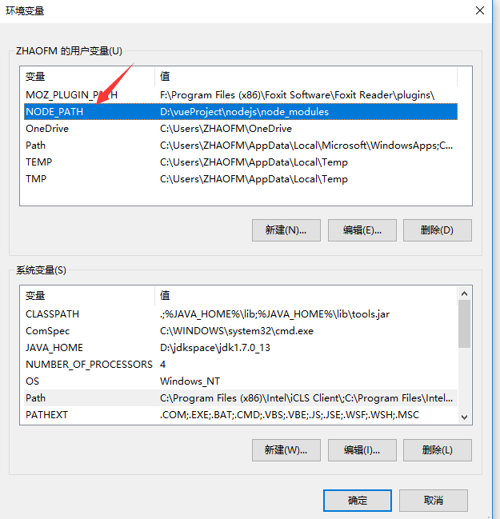

#  基于SpringCloud Alibaba+vue3.0前后端分离在线教育平台

# 第1章 项目说明及功能演示

## 1.1 项目说明

本项目 基于springcloud alibaba+vue3.0整合开发前后端分离在线教育平台，整个平台分为前台和后台 ，后端主要采用的技术有：

- 以Spring Framework为核心容器；
- Spring MVC为模型视图控制器；
- Mybatis Plus为数据访问层；
- spring security为权限授权层；
- Redis为分布式缓存；
- 注册中心、配置中心选型Nacos；
- 流量控制框架选型Sentinel；
- vue3.0+[admin-element-vue-typescript](http://tsv2-demo.admin-element-vue.liqingsong.cc/) 作为前端框架并进行前后端分离的开源框架。


前端主要采用的技术是： [Vue3.x](https://github.com/vuejs/vue-next) +  [Vuex4.x](https://github.com/vuejs/vuex) +  [Vue-router4.x](https://github.com/vuejs/vue-router-next) +   [Axios](https://github.com/axios/axios) + [TypeScript](https://github.com/Microsoft/TypeScript) + [Element Plus](https://github.com/element-plus/element-plus) .

后台管理模板

 [admin-element-vue-typescript](http://tsv2-demo.admin-element-vue.liqingsong.cc/) 

文档地址地址： http://admin-element-vue.liqingsong.cc/tsv2/guide/


## 1.2 功能演示

 前台演示地址：http://www.xueden.cn/

后台演示地址：http://cms.xueden.cn/


# 第2章 准备工作


## 2.1   **安装node.js**  


```shell
https://nodejs.org/en/download/
```


下载后，直接双击并下一步即可，这个比较简单


## 2.2   **设置nodejs prefix（全局）和cache（缓存）路径** 

  原因：因为在执行例如npm install webpack -g等命令全局安装的时候，默认会将模块安装在C:\Users\用户名\AppData\Roaming路径下的npm和npm_cache中，会占用C盘空间以及不利管理。 

在nodejs安装路径下，新建node_global和node_cache两个文件夹 ；

 设置缓存文件夹 (根据自己安装路径)

```shell
npm config set cache "E:\anzhuang\nodejs\node_cache"
```

 设置全局模块存放路径  (根据自己安装路径)

```shell
npm config set prefix "E:\anzhuang\nodejs\node_global"
```

 设置成功后，之后用命令npm install XXX -g安装以后模块就在E:\anzhuang\nodejs\node_global里 


## 2.3  **基于 Node.js 安装cnpm（淘宝镜像）** 

输入以下命令进行安装；

```shell
npm install -g cnpm --registry=https://registry.npm.taobao.org
```


## 2.4  **设置环境变量（非常重要）** 

说明：设置环境变量可以使得住任意目录下都可以使用cnpm、vue等命令，而不需要输入全路径

1、鼠标右键"此电脑"，选择“属性”菜单，在弹出的“系统”对话框中左侧选择“高级系统设置”，弹出“系统属性”对话框。

2、修改系统变量PATH


 3、新增系统变量NODE_PATH 




## 2.5  **安装Vue** 

```shell
cnpm install vue -g
```

## 2.6  **安装vue命令行工具，即vue-cli 脚手架** 

```shell
cnpm install vue-cli -g
```


## 2.7 安装mysql5.7

### 2.7.1 下载mysql5.7 镜像

```shell
docker pull mysql:5.7
```

### 2.7.2 创建实例并启动

```shell
docker run -p 3306:3306 --name mysql \
-v /data/mysql/log:/var/log/mysql \
-v /data/mysql/data:/var/lib/mysql \
-v /data/mysql/conf:/etc/mysql \
-e MYSQL_ROOT_PASSWORD=root \
-d mysql:5.7
```


### 2.7.3 配置mysql

先创建  my.cnf 文件，输入命令：

```shell
cd /mydata/mysql/conf
```

```shell
vi my.cnf
```

复制以下内容：

```shell
[client]
default-character-set=utf8
[mysql]
default-character-set=utf8
[mysqld]
init_connect='SET collation_connection = utf8_unicode_ci'
init_connect='SET NAMES utf8'
character-set-server=utf8
collation-server=utf8_unicode_ci
skip-character-set-client-handshake
skip-name-resolve
```


保存退出，重启mysql容器即可：

```shell
docker restart mysql
```


### 2.7.4 设置启动docker时，即运行mysql 

```shell
docker update mysql --restart=always
```


## 2.8 安装redis

### 2.8.1 下载redis镜像

```shell
docker pull redis
```

### 2.8.2 创建实例并启动

输入以下命令创建文件夹和文件

```shell
mkdir -p /data/redis/conf
```

```shell
touch /data/redis/conf/redis.conf
```

```shel
docker run -p 6379:6379 --name redis2 -v /data/redis/data:/data \
-v /data/redis/conf/redis.conf:/etc/redis/redis.conf \
-d redis redis-server /etc/redis/redis.conf 
```

### 2.8.3 配置redis持久化

修改redis.conf,加入如下代码：

```shell
appendonly yes
```

保存退出，重启redis即可

```shell
docker restart redis
```


### 2.8.4 设置Redis开机自启

```shell
docker update redis --restart=always
```


## 2.9 安装nacos

### 2.9.1 下载 nacos 镜像

```shell
docker pull nacos/nacos-server
```

### 2.9.2 启动nacos

```shell
docker run  -d \
-e MODE=standalone \
-e SPRING_DATASOURCE_PLATFORM=mysql \
-e MYSQL_SERVICE_HOST=192.168.56.10 \
-e MYSQL_SERVICE_PORT=3306 \
-e MYSQL_SERVICE_USER=root \
-e MYSQL_SERVICE_PASSWORD=root \
-e MYSQL_SERVICE_DB_NAME=nacos_xueden \
-p 8848:8848 \
--name nacos \
--restart=always \
nacos/nacos-server
```

默认访问nacos路径： http://localhost:8848/nacos 

虚拟机： http://192.168.56.10:8848/nacos/#/login 


默认账号和密码都是:nacos


## 2.10 安装 sentinel-dashboard 

 Sentinel 控制台是流量控制、熔断降级规则统一配置和管理的入口，它为用户提供了机器自发现、簇点链路自发现、监控、规则配置等功能。在 Sentinel 控制台上，我们可以配置规则并实时查看流量控制效果。 

### 2.10.1 下载 sentinel-dashboard 

使用如下命令拉取镜像

```shell
docker pull bladex/sentinel-dashboard
```


### 2.10.2 启动sentinel-dashboard 

```shell
docker run --name sentinel  -d -p 8858:8858 -d  bladex/sentinel-dashboard
```

默认账号和密码都是：sentinel

sentinel官方文档：

 [https://github.com/alibaba/Sentinel/wiki/%E4%B8%BB%E9%A1%B5](https://github.com/alibaba/Sentinel/wiki/主页) 


# 第3章 后端项目基础框架搭建


## 3.1 创建父工程


## 3.2 创建核心公共模块


## 3.3 编写实体类


## 3.4 创建日志模块


## 3.5 创建mybatis-plus模块


## 3.6 创建redis缓存模块


## 3.7 创建spring security 安全认证模块


## 3.8 创建swagger模块


## 3.9 创建网关微服务


### 3.9.1 创建网关命名空间moyu-gateway7000 

GATEWAY_GROUP

### 3.9.2  创建bootstrap.yml文件

代码如下所示

```yml
server:
  port: 7000

# Spring
spring:
  application:
    # 应用名称
    name: moyu-gateway
  profiles:
    # 环境配置
    active: dev
  main:
    allow-bean-definition-overriding: true
  cloud:
    nacos:
      discovery:
        # 服务注册地址
        server-addr: 192.168.56.11:8848
      config:
        # 配置中心地址
        server-addr: 192.168.56.11:8848
        # 配置文件格式
        file-extension: yml
        # 共享配置
        shared-dataids: application-${spring.profiles.active}.${spring.cloud.nacos.config.file-extension}
        #默认为Public命名空间,可以省略不写，新建的命名空间，需要使用命名空间ID， 不能使用名称
        namespace: a6714009-d616-4d63-bb15-3bd908cb76bd
        #指定配置群组 --如果是Public命名空间 则可以省略群组配置
        group: GATEWAY_GROUP
```


### 3.9.3 创建 moyu-gateway-dev.yml 文件


代码如下所示：

```yaml
spring:
  redis:
    database: 1
    host: 192.168.56.11
    port: 6379
    password:      # 密码（默认为空）
    timeout: 6000  # 连接超时时长（毫秒）
    lettuce:
      shutdown-timeout: 100 # 关闭超时时间
      pool:
        max-active: 1000  # 连接池最大连接数（使用负值表示没有限制）
        max-wait: -1      # 连接池最大阻塞等待时间（使用负值表示没有限制）
        max-idle: 10      # 连接池中的最大空闲连接
        min-idle: 5       # 连接池中的最小空闲连接

  cloud:
    gateway:
      discovery:
        locator:
          lowerCaseServiceId: true
          enabled: true
      routes:
        # 认证中心
        - id: moyu-auth
          uri: lb://moyu-auth
          predicates:
            - Path=/auth/**
          filters:
            # 验证码处理
            - CacheRequestFilter
            - ValidateCodeFilter
            - StripPrefix=1
        # 系统模块
        - id: moyu-system
          uri: lb://moyu-system
          predicates:
            - Path=/system/**
          filters:
            - StripPrefix=0

# 不校验白名单
ignore:
  whites:
    - /auth/logout
    - /auth/login
    - /*/v2/api-docs
    - /csrf      
nacos:
  config: hello nacos        
```


## 3.10 创建认证授权中心微服务


### 3.10.1 创建命名空间 moyu-auth8000 


### 3.10.2 创建bootstrap.yml文件

代码如下所示：

```yaml
server:
  port: 8000

# Spring
spring: 
  application:
    # 应用名称
    name: moyu-auth
  profiles:
    # 环境配置
    active: dev
  main:
    allow-bean-definition-overriding: true
  cloud:
    nacos:
      discovery:
        # 服务注册地址
        server-addr: 192.168.56.11:8848
      config:
        # 配置中心地址
        server-addr: 192.168.56.11:8848
        # 配置文件格式
        file-extension: yml
        # 共享配置
        shared-dataids: application-${spring.profiles.active}.${spring.cloud.nacos.config.file-extension}
        #默认为Public命名空间,可以省略不写，新建的命名空间，需要使用命名空间ID， 不能使用名称
        namespace: 4fc375e6-9cf7-405e-aef3-7cc0f049aa83
        #指定配置群组 --如果是Public命名空间 则可以省略群组配置
        group: AUTH_GROUP

```


### 3.10.3 创建 moyu-auth-dev.yml 文件


代码如下：

```yaml
spring:
 # 数据源配置
  datasource:
    url: jdbc:mysql://192.168.56.10:3306/moyu_cloud_layui?serverTimezone=UTC&useUnicode=true&characterEncoding=utf8&useSSL=false&tinyInt1isBit=true
    username: root
    password: root

  redis:
    database: 1
    host: 192.168.56.10
    port: 6379
    password:      # 密码（默认为空）
    timeout: 6000  # 连接超时时长（毫秒）
    lettuce:
      shutdown-timeout: 100 # 关闭超时时间
      pool:
        max-active: 1000  # 连接池最大连接数（使用负值表示没有限制）
        max-wait: -1      # 连接池最大阻塞等待时间（使用负值表示没有限制）
        max-idle: 10      # 连接池中的最大空闲连接
        min-idle: 5       # 连接池中的最小空闲连接
nacos:
  config: hello nacos2     
```


## 3.11 创建系统管理微服务


### 3.11.1 创建命名空间moyu-system9000 


### 3.11.2  创建bootstrap.yml文件

代码如下所示：

```yaml
# Tomcat
server:
  port: 9000

# Spring
spring: 
  application:
    # 应用名称
    name: moyu-system
  profiles:
    # 环境配置
    active: dev
  cloud:
    nacos:
      discovery:
        # 服务注册地址
        server-addr: 192.168.56.11:8848
      config:
        # 配置中心地址
        server-addr: 192.168.56.11:8848
        # 配置文件格式
        file-extension: yml
        # 共享配置
        shared-dataids: application-${spring.profiles.active}.${spring.cloud.nacos.config.file-extension}
        #默认为Public命名空间,可以省略不写，新建的命名空间，需要使用命名空间ID， 不能使用名称
        namespace: fdabc74b-e966-4f5d-86ea-ff69e4db44d0
        #指定配置群组 --如果是Public命名空间 则可以省略群组配置
        group: SYSTEM_GROUP

```


### 3.11.3 创建moyu-system-dev.yml文件

代码如下所示：

```yaml
# Spring
spring: 
  redis:
    database: 1
    host: 192.168.56.11
    port: 6379
    password:      # 密码（默认为空）
    timeout: 6000  # 连接超时时长（毫秒）
    lettuce:
      shutdown-timeout: 100 # 关闭超时时间
      pool:
        max-active: 1000  # 连接池最大连接数（使用负值表示没有限制）
        max-wait: -1      # 连接池最大阻塞等待时间（使用负值表示没有限制）
        max-idle: 10      # 连接池中的最大空闲连接
        min-idle: 5       # 连接池中的最小空闲连接
  datasource:
    driver-class-name: com.mysql.cj.jdbc.Driver
    url: jdbc:mysql://192.168.56.11:3306/moyu_cloud_layui?useUnicode=true&characterEncoding=utf8&zeroDateTimeBehavior=convertToNull&useSSL=true&serverTimezone=GMT%2B8
    username: root
    password: root


mybatis-plus:
  mapper-locations: classpath:mapper/*.xml
  #实体扫描，多个package用逗号或者分号隔离
  typeAliasesPackage: cn.xueden.system
  global-config:
    #主键类型  0:"数据库ID自增", 1:"用户输入ID",2:"全局唯一ID (数字类型唯一ID)", 3:"全局唯一ID UUID";
    id-type: 0
    #字段策略 0:"忽略判断",1:"非 NULL 判断"),2:"非空判断"
    field-strategy: 2
    #驼峰下划线转换
    db-column-underline: true
    #刷新mapper 调试神器
    refresh-mapper: true
    #数据库大写下划线转换
    #capital-mode: true
    #序列接口实现类配置
    #key-generator: com.baomidou.springboot.xxx
    #逻辑删除配置
    #    logic-delete-value: 1
    #    logic-not-delete-value: 0
    #自定义填充策略接口实现
    metaObjectHandler: cn.xueden.mybatis.config.SysMetaObjectHandler
    #自定义SQL注入器
    #sql-injector: com.baomidou.springboot.xxx
    configuration:
      map-underscore-to-camel-case: true
      cache-enabled: false    

# swagger 配置
swagger:
  title: 系统模块接口文档
  license: Powered By moyu
  licenseUrl: http://www.xueden.cn
  authorization:
    name: MoYu OAuth
    auth-regex: ^.*$
    authorization-scope-list:
      - scope: server
        description: 客户端授权范围
    token-url-list:
      - http://localhost:8080/auth/oauth/token
```


## 3.12 创建微服务接口模块


# 第4章 前端项目基础框架搭建


## 4.1 下载layuimini及运行

layuimini官网地址： http://layuimini.99php.cn/ 


## 4.2 layuimini首页调整


## 4.3 完善前端项目


# 第5章 登录模块功能实现


## 5.1 验证码功能实现


## 5.2 验证码限流功能实现

网关加入sentinel，代码如下所示：

```yaml
sentinel:
      # 取消控制台懒加载
      eager: true
      transport:
        # 控制台地址
        dashboard: 192.168.56.11:8858
```


共享配置 application-dev.yml

代码如下所示：

```yaml
spring:
  main:
    allow-bean-definition-overriding: true

#请求处理的超时时间
ribbon:
  ReadTimeout: 10000
  ConnectTimeout: 10000

# feign 配置
feign:
  sentinel:
    enabled: true
  okhttp:
    enabled: true
  httpclient:
    enabled: false
  client:
    config:
      default:
        connectTimeout: 10000
        readTimeout: 10000
  compression:
    request:
      enabled: true
    response:
      enabled: true

# 暴露监控端点
management:
  endpoints:
    web:
      exposure:
        include: '*'

```


## 5.3 验证码限流持久化


新建sentinel-moyu-gateway，格式是json

代码如下所示：

```json
[
    {
        "resource": "moyu-auth",
        "count": 500,
        "grade": 1,
        "limitApp": "default",
        "strategy": 0,
        "controlBehavior": 0
    },
	{
        "resource": "moyu-system",
        "count": 1000,
        "grade": 1,
        "limitApp": "default",
        "strategy": 0,
        "controlBehavior": 0
    },
	{
        "resource": "moyu-gateway",
        "count": 300,
        "grade": 1,
        "limitApp": "default",
        "strategy": 0,
        "controlBehavior": 0
    }
]
```


## 5.4 验证码校验功能的实现


## 5.5 登录认证功能实现


# 第6章 菜单管理模块功能实现


## 6.1 获取左边菜单功能实现


## 6.2 获取菜单列表功能实现


## 6.3 新增菜单功能实现


## 6.4 编辑菜单功能实现


## 6.5 删除菜单功能实现


# 第7章 角色管理模块功能实现


## 7-1 角色列表功能实现


## 7-2添加角色功能实现


## 7-3 编辑角色功能实现


## 7-4删除角色功能实现


## 7-5批量删除角色功能实现


# 第8章 用户管理模块功能实现


## 8-1 获取用户列表功能实现


## 8-2新增用户功能实现


## 8-3编辑用户功能实现


## 8-4删除用户功能实现


## 8-5 批量删除用户功能实现


## 8-6 修改用户密码功能实现


## 8-7 修改用户个人信息功能实现


## 8-8 清理用户缓存功能实现


# 第9章 日志管理模块功能实现

## 9.1 获取日志列表功能实现

## 9.2 新增日志功能实现

## 9.3 删除日志列表功能实现


# 第10章 使用docker部署微服务

把各个微服务打包上传到服务器上，如：阿里云、腾讯云等

## 10.1 部署网关微服务

### 10.1.1 创建网关的Dockerfile文件

代码如下所示：

```shell
#获取base image
FROM adoptopenjdk/openjdk8:latest 
MAINTAINER moyu 11184629@qq.com

#类似于linux copy指令
COPY moyu-gateway-1.0.0.jar /opt/app/layuicloud/       
#对外端口
EXPOSE 7000
#执行命令 java -jar /opt/app/layuicloud/moyu-gateway-1.0.0.jar
ENTRYPOINT ["java","-Xmx256m", "-jar", "/opt/app/layuicloud/moyu-gateway-1.0.0.jar","--spring.profiles.active=dev","-c"] 

```


### 10.1.2 创建网关微服务镜像

运行如下代码：

```shell
docker build -t moyu-gateway:v1.0.0 .
```


### 10.1.3 生成网关微服务容器

代码如下所示：

```shell
docker run --restart always --name gateway -it -p 7000:7000 moyu-gateway:v1.0.0
```


### 10.1.4  查看网关微服务启动日志

代码如下：

```shell
docker logs gateway --tail 100 -f
```


### 10.1.5 暂停容器

```shell
docker stop gateway
```

### 10.1.6 删除容器

```shell
docker rm gateway
```

### 10.1.7 删除镜像

```shell
docker rmi gateway
```


 ## 10.2 部署系统管理微服务


### 10.2.1 创建系统管理微服务的Dockerfile文件

代码如下所示：

```shell
#获取base image
FROM adoptopenjdk/openjdk8:latest 
MAINTAINER moyu 11184629@qq.com

#类似于linux copy指令
COPY moyu-system-1.0.0.jar /opt/app/layuicloud/       
#对外端口
EXPOSE 9000
#执行命令 java -jar /opt/app/layuicloud/moyu-system-1.0.0.jar
ENTRYPOINT ["java","-Xmx256m", "-jar", "/opt/app/layuicloud/moyu-system-1.0.0.jar","--spring.profiles.active=dev","-c"] 

```


### 10.2.2 创建系统管理微服务镜像


代码如下所示：

```shell
docker build -t moyu-system:v1.0.0 .
```


### 10.2.3 生成系统管理微服务容器


代码如下所示：

```shell
docker run --restart always --name system -it -p 9000:9000 moyu-system:v1.0.0
```


##  10.3 部署认证授权微服务


### 10.3.1 创建认证授权微服务的Dockerfile文件


代码如下所示：

```shell
#获取base image
FROM adoptopenjdk/openjdk8:latest 
MAINTAINER moyu 11184629@qq.com

#类似于linux copy指令
COPY moyu-auth-1.0.0.jar /opt/app/layuicloud/       
#对外端口
EXPOSE 8000
#执行命令 java -jar /opt/app/layuicloud/moyu-auth-1.0.0.jar
ENTRYPOINT ["java","-Xmx256m", "-jar", "/opt/app/layuicloud/moyu-auth-1.0.0.jar","--spring.profiles.active=dev","-c"] 

```


### 10.3.2 创建认证授权微服务镜像

代码如下所示：

```shell
docker build -t moyu-auth:v1.0.0 .
```


 ### 10.3.3 生成认证授权微服务容器

代码如下所示：

```shell
docker run --restart always --name auth -it -p 8000:8000 moyu-auth:v1.0.0
```


## 10.4 部署教育微服务

暂停容器：

```shell
docker stop edu
```

删除容器：

```shell
docker rm edu
```

删除镜像：

```shell
docker rmi 镜像id
```


### 10.4.1 创建认证授权微服务的Dockerfile文件

代码如下所示：

```shell
#获取base image
FROM adoptopenjdk/openjdk8:latest 
MAINTAINER moyu 11184629@qq.com

#类似于linux copy指令
COPY moyu-edu-1.0.0.jar /opt/app/layuicloud/       
#对外端口
EXPOSE 6000
#执行命令 java -jar /opt/app/layuicloud/moyu-edu-1.0.0.jar
ENTRYPOINT ["java","-Xmx256m", "-jar", "/opt/app/layuicloud/moyu-edu-1.0.0.jar","--spring.profiles.active=dev","-c"] 

```


### 10.4.2 创建教育微服务镜像

代码如下所示：

```shell
docker build -t moyu-edu:v1.0.0 .
```


### 10.4.3 生成教育微服务容器

代码如下所示：

```shell
docker run --restart always --name edu -it -p 6000:6000 moyu-edu:v1.0.0
```


如果需要挂载文件夹：(网上部署，微信支付和支付宝支付)

```shell
docker run --restart always --name edu -it -p 6000:6000 -v /var/xueden:/var/xueden:ro moyu-edu:v1.0.0
```


实时查看日志

```shell
docker logs -f -t --tail 100 edu
```

```shell
docker logs -f -t  --tail="200" system
```

 查看防火墙所有开放的端口 

```shell
firewall-cmd --zone=public --list-ports
```


开发端口号

```shell
firewall-cmd --zone=public --add-port=6000/tcp --permanent
```

配置立即生效

```shell
firewall-cmd --reload
```

